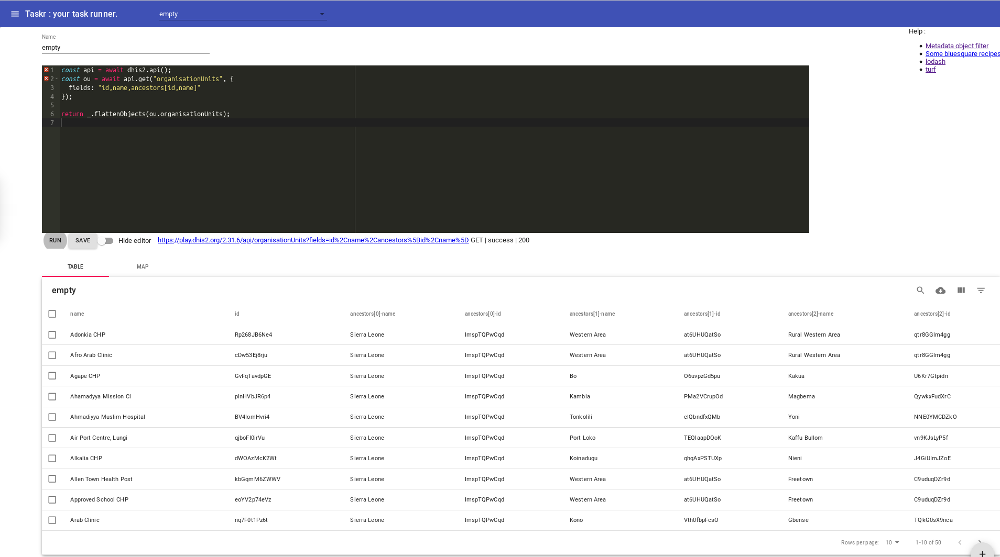
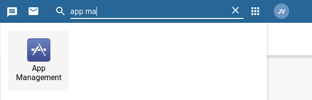
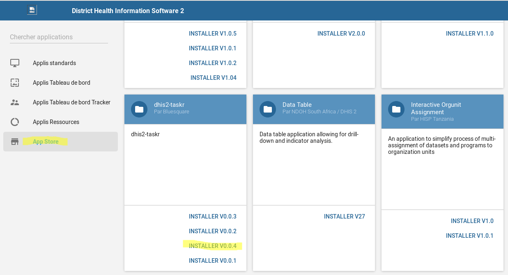
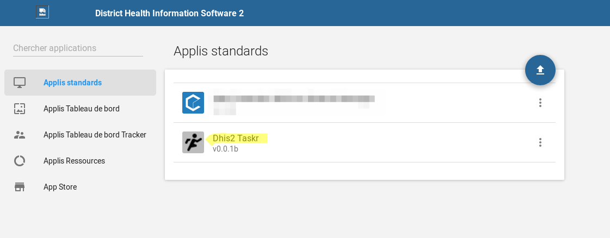

# Context

Small dhis2 scripts editor/runner to automate recurring tasks.



Script in JavaScript

  - Can combine multiple api calls
  - Add filter logic, calculations
  - Reusable and customisable recipes
  - Write once - Rerun whenever you need

can display results

- As table, Exportable as CSV
- As a map, If coordinate, coordinates or geometry field
- As json

can also produce files

- xlsx
- json
- csv

# Development
## Prerequisite

install nodejs and yarn

```
  brew install yarn
```

## Create a .env.development

see
or take you personal user

```
REACT_APP_DHIS2_URL=https://play.dhis2.org/2.32.2
REACT_APP_USER=admin
REACT_APP_PASSWORD=district
```

## Start developement mode

```
yarn start
Then go to http://127.0.0.1:3000/ or http://localhost:3000
```

Note that localhost:3000 and 127.0.0.0:3000 needs to be whitelisted in Dhis2 Settings -> Access -> CORS whitelist
see https://<<your-dhis2>>/dhis-web-settings/index.html#/access


## if you don't have access rights, you might want to proxy the dhis2 api request

in package.json

```
 "proxy": "https://mydhis2",
```

in .env.development

```
REACT_APP_DHIS2_URL=http://localhost:3000
REACT_APP_USER=xxxxxxxxxxxx
REACT_APP_PASSWORD=xxxxxxxxxxxx
```

# Production

## Install from the app store (recommanded)

Go to the app management



In the app store section, find the dhis2-taskr app and install the latest version



Once installed, click on the app



and you can run your first recipes !


## Deployment to production (from source)

```
./ship.sh 'https://play.dhis2.org/2.31.6' 'admin' '<password>'
```

# Official release - How to

1. Make sure to update the CHANGELOG.md
2. Adapt `package.json` and `public/manifest.webapp` to have the next version number
3. Build a zip by launching `./release.sh`
4. Login in to `https://apps.dhis2.org/`
   - Dhis2 Taskr => new version, 
   - upload the zip
   - pick to the lower dhis2 version and higher dhis2 version (we are probably compatible)
5. Test the released app on a [play](https://play.dhis2.org/) instance (cfr app management, install)
6. Version cleanup 
   - don't delete the 0.0.23 version (it's the last app supporting really old dhis2 versions), 
   - but you can delete perhaps other intermediate versions (except if major changes happened)
