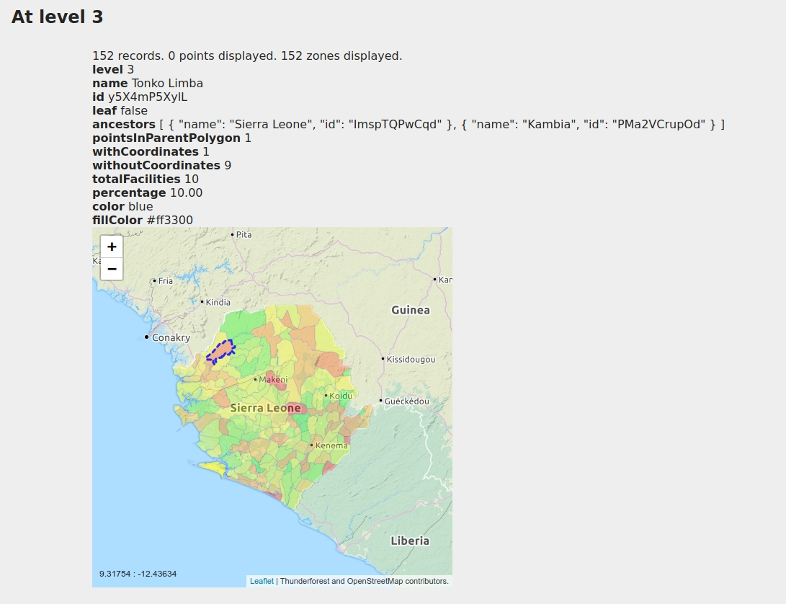
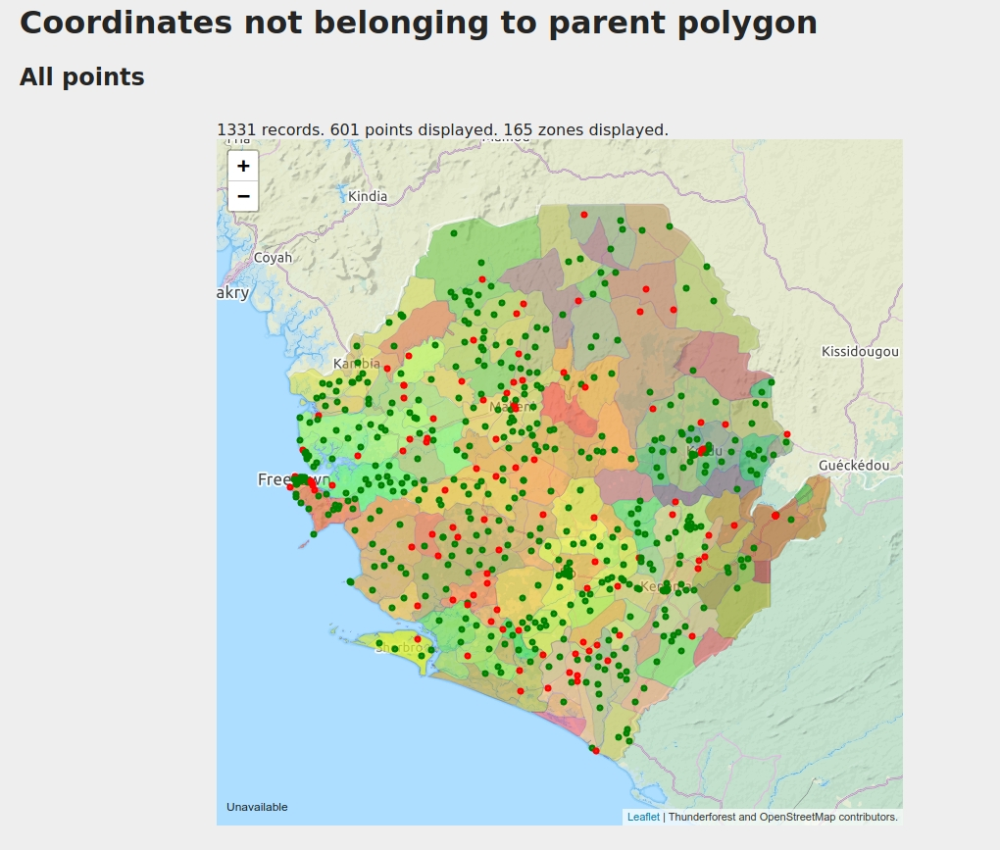
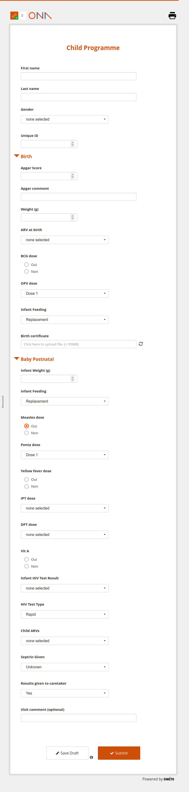

# Table of content

- [Table of content](#table-of-content)
- [What is TaskR](#what-is-taskr)
- [Disclaimer](#disclaimer)
- [Small tour](#small-tour)
  - [Open the app](#open-the-app)
  - [Recipes list](#recipes-list)
  - [Recipe page](#recipe-page)
- [Historical pains & motivations](#historical-pains--motivations)
  - [1. Turning api call results into csv or a map was not easy](#1-turning-api-call-results-into-csv-or-a-map-was-not-easy)
  - [2. Coding a dhis2 app is sometimes too much work for just a specific one-shot task](#2-coding-a-dhis2-app-is-sometimes-too-much-work-for-just-a-specific-one-shot-task)
  - [3. Combining multiple api calls is hard](#3-combining-multiple-api-calls-is-hard)
  - [4. Data can come in and out in various formats](#4-data-can-come-in-and-out-in-various-formats)
  - [5. Sometimes we need JS or GIS super power](#5-sometimes-we-need-js-or-gis-super-power)
  - [6. End user autonomy to re-run the recipe at will](#6-end-user-autonomy-to-re-run-the-recipe-at-will)
  - [7. Standard recipes reusable accross dhis2](#7-standard-recipes-reusable-accross-dhis2)
  - [8. Recipes can accept parameters](#8-recipes-can-accept-parameters)
  - [9. Recipe can return more than a table](#9-recipe-can-return-more-than-a-table)
  - [10. Accessing multiple dhis2 instances](#10-accessing-multiple-dhis2-instances)
- [Getting started](#getting-started)
  - [Installing the app](#installing-the-app)
  - [Standard recipes](#standard-recipes)
    - [Users - Super user, inactive user, never logged in audit](#users---super-user-inactive-user-never-logged-in-audit)
    - [Users - Create users based on a csv](#users---create-users-based-on-a-csv)
    - [Organisation Units - Coordinates](#organisation-units---coordinates)
    - [XLSForm - Generate a basic xlsform for a program](#xlsform---generate-a-basic-xlsform-for-a-program)
    - [XLSForm - generate a xlsform from a DataSet](#xlsform---generate-a-xlsform-from-a-dataset)
    - [XLSForm - Diff two xlsform](#xlsform---diff-two-xlsform)
    - [Dataviz - update custom attributes of program indicator](#dataviz---update-custom-attributes-of-program-indicator)
    - [Your recipe?](#your-recipe)
  - [Specific recipes](#specific-recipes)
- [Coding tutorial](#coding-tutorial)
  - [Turn an api call in to a csv](#turn-an-api-call-in-to-a-csv)
    - [v0.0 get all orgunits](#v00-get-all-orgunits)
    - [v0.1 get all orgunits for a certain level as parameter](#v01-get-all-orgunits-for-a-certain-level-as-parameter)
  - [Generate a csv to create users based on the level 3](#generate-a-csv-to-create-users-based-on-the-level-3)
  - [Synchronous api calls in a loop](#synchronous-api-calls-in-a-loop)
  - [Generate a json with download prompt](#generate-a-json-with-download-prompt)
  - [Dhis2 periods](#dhis2-periods)
  - [Let's update things](#lets-update-things)
    - [First a readonly version](#first-a-readonly-version)
    - [Introduce a "dryRun" mode](#introduce-a-dryrun-mode)
    - [Test on the first record](#test-on-the-first-record)
    - [Run on all users](#run-on-all-users)
    - [If the recipe is here to stay](#if-the-recipe-is-here-to-stay)
  - [Want more?](#want-more)


# What is TaskR

TaskR is a way to create and run scripts called "recipes" that can interacts with the DHIS2 api and generate table, maps or various type of output.

Think "Small Jupyther Notebooks" for dhis2.

# Disclaimer

> When the only tool you have is TaskR, everything start to look like a recipe

It gets addictive, you can spend hours automating something that could have been done in 10 minutes clicking around in a few screens.

> With great power comes great responsibility

Taskr recipes run with the user's privilege. If you are admin the recipe has all the possibilities the admin has.

> "To err is human, but for a real disaster you need a computer"

What can harm a dhis2 by clicking the wrong option in a menu in the dataElement option, can turn into a disaster when the same operation is repeated in a loop in taskr. It can get worse when what is in the loop is not the correct action or was not meant to run on all data elements. Be careful.


# Small tour

## Open the app

Once the app is installed you can locate it in the menu.


## Recipes list


The recipes list screen is accessible via the top left hamburger menu icon. A list of recipes is shown:
   - grey out recipes are "built-in".
   - blank recipees are the ones created and saved in your dhis2

Clicking on the Show button, you arrive fill on the recipe page.

## Recipe page

Fill in the parameters if needed, click run, the results will show under the buttons.


If an error occurs in the recipe (syntax or dhis2 api calls), it will show up on the top of your screen.


If you are in edit mode the recipe editor will show up.

A recipe is composed of
 - the code (javascript snippet)
 - the paremeters definition (optional, json)
 - the report (optional, markdown with [idyll](https://idyll-lang.org/) components)

# Historical pains & motivations

## 1. Turning api call results into csv or a map was not easy

Let's get all orgunits with their coordinates and ancestors as a csv. If the recipe returns an array of things with a geometry/coordinates/coordinate field taskr will also try to display it as a map.

```js
const api = await dhis2.api();
const ou = await api.get("organisationUnits", {
  fields: "id,name,ancestors[id,name],geometry",
  paging: false
});

return _.flattenObjects(ou.organisationUnits, ["geometry"]);
```

The table is filterable either via the search icon or more accurately via the filter dialog and you can download the data as a csv via the cloud icon.


The orgunits map is clickable, zoomable and you can switch between different layers. It supports simple coordinates or shapes as defined by dhis2 geometry/coordinates field.


## 2. Coding a dhis2 app is sometimes too much work for just a specific one-shot task

Let's say you want to rename all indicators starting with "INDX.Y name" to "IND X.Y - name".

Setting up a dhis2 app requires time and developer knowledge. Taskr is a good tradeoff, you can install/update the app from the app store. With basic programming knowledge or using the standard recipes you can already automate a few tasks without the *initial setup cost*.

An additional benefit of a recipe versus a script running on a developer machine is that it can be run again (and not only by a developer) and is deployed with the DHIS2 instance so will not be lost on a single person machine.

## 3. Combining multiple api calls is hard

Want to find all the tracker data elements not referenced by program stages ?

There is no link between `/api/dataElements` and the programs, and the `/api/programs` only returns the used data elements.

So here we need to combine the 2 calls to find unreferenced data elements.

Since the api call is done via javascript, we can easily combine, merge and filter the results at our will.

```js
const api = await dhis2.api();

const de = await api.get("dataElements", {
  fields: "id,name,href,domainType",
  filter: "domainType:eq:TRACKER",
  paging: false
});

const programResp = await api.get("programs", {
  fields: "programStages[programStageDataElements[dataElement[id]]]",
  paging: false
});

const usedByPrograms = new Set(
  programResp.programs
    .flatMap(program => program.programStages)
    .flatMap(ps => ps.programStageDataElements.map(psde => psde.dataElement.id))
);

return de.dataElements.filter(de => !usedByPrograms.has(de.id));

```

## 4. Data can come in and out in various formats

We receive data in various forms (csv, xlsx, json...)

We want to produce various formats (csv, xlsx, json), or show a small UI to be able to filter/explore the data.

Taskr recipes can accept all of them and makes the recipe easy to code, as it will already parse the data.

CSV will be parsed by the [papaparse](https://www.papaparse.com/) library.
XLSX will be parsed by the [xlsx-populate](https://github.com/dtjohnson/xlsx-populate#usage), the recipe can also produce xlsx.
JSON will be parsed by the browser itself.


## 5. Sometimes we need JS or GIS super power

In js some trivial functions are not in the language, to help with this [lodash](https://lodash.com/docs) is available in the recipe code.

> Lodash makes JavaScript easier by taking the hassle out of working with arrays, numbers, objects, strings, etc.

Lodash is available in the `_`, so you can use `_.keyBy` for example:

```js
// create dataelement lookup by id
const dataElementById = _.keyBy(resp.dataElements, de => de.id);
```

Let's say you are working on a project setting up a health facility registry. You received data from a partner and need to integrate it with your existing facilities.

You might want to find nearest healthcenter, or the parent orgunits containing that point. That's why [turfjs](https://turfjs.org) is integrated in taskr.

> TurfJS: Advanced geospatial analysis for browsers and Node.js

Find possible parents based on the coordinates of the point and parent shapes:

```js
allOrgunits.forEach(ou => turf.geometrify(ou))
points.forEach(point => {
  const parents = allOrgunits.filter(ou => {
    try {
      return ou.geometry && turf.inside(point, ou.geometry);
    } catch (ignored) {
      return false;
    }
  });
  point.parents = parents.map(ou => ou.name).join(",");
});

```

Find organisation unit within 50 meters

```js
points.forEach(point => {
  const nearBy = ouFosa.organisationUnits
    .filter(ou => {
      return (
        ou.geometry &&
        point.geometry &&
        turf.distance(ou.geometry, point.geometry, { units: "meters" }) < 50
      );
    });
    point.nearBy = nearBy
})
```

## 6. End user autonomy to re-run the recipe at will

Some recipes needs to be re-run multiple times, ideally without the help of a developer, some possible use cases:
  - a quarterly export with the data in xlsx in a specific format
  - fixing dhis2 data/config, and re-run each time you fixed some of them, to review the remaining one.
  - import some data from last quarter in a known format (but not the one dhis2 expect by default)

## 7. Standard recipes reusable accross dhis2

Some recipes are quite common to all dhis2-es and it should be easy to install the app (without asking a developer to do it)

   - user audit
   - coordinates/geometry audit
   - create users based on csv with username, name, email, roles, password, managed orgunit
   - export events as csv
   - generate an xlsform based on a program
   - ...

Make sure to always have the latest version of taskr.

## 8. Recipes can accept parameters

Most recipes will needs params
   - a dhis2 resources (a program, an orgunit, an orgunit of a given level, a dataset,...)
   - files (xlsx, json, csv)
   - a string (a dhis2 period ?)
   - a select between options

Before running you'll get a small screen to enter them


The parameters are defined currenly as json like this:

```json
[
    {
        "id": "program",
        "label": "Search for program",
        "type": "dhis2",
        "resourceName": "programs",
        "default": "sample"
    },
    {
        "id": "datalementTracker",
        "label": "Search for tracker data element",
        "type": "dhis2",
        "resourceName": "dataElements",
        "filter": "domainType:eq:TRACKER"
    },
    {
        "id": "datalementAggregate",
        "label": "Search for aggregate data element",
        "type": "dhis2",
        "resourceName": "dataElements",
        "filter": "domainType:eq:AGGREGATE"
    },
    {
        "id": "mode",
        "label": "Select run mode",
        "type": "select",
        "default": "generateEmptyCsv",
        "choices": [
            [
                "generateEmptyCsv",
                "Generate an empty csv"
            ],
            [
                "dryRun",
                "Import from csv - Dry run"
            ],
            [
                "import",
                "Import from csv - import events"
            ]
        ]
    },
    {
        "id": "file",
        "label": "Pick csv with event values",
        "type": "csv",
        "helperText": "you can use 'Generate an empty csv' run mode to generate a template"
    },
     {
        "id": "filexlsx",
        "label": "Pick xlsx with the data",
        "type": "xlsx",
        "helperText": "you can use 'Generate an empty csv' run mode to generate a template"
    }
]
```

These parameters are then available in the recipe code, through the `parameters` variable:

```js
const programId = parameters.program.id;

const dryRun = parameters.mode =="dryRun";

const events = parameters.file.data;
```

## 9. Recipe can return more than a table

Some recipes needs to return more than a table.
This is possible thanks to a small report defined as markdown.
Based on [idyll-lang](https://idyll-lang.org/)


The recipe register some datasets.

```js
report.register("stats_level2", stats);
```

The recipe has a report in markdown referencing these datasets, adding some contextual content.

```markdown
[PageOrientation orientation:"landscape" /]
# Coordinates Coverage

> Number of org units with coordinates
> --------------------------------------------------------------------
>                 Number of org units

[PageBreak /]
## At level 2
[FlexBox]
[OrgunitMap lines:stats_level2 /]
[/FlexBox]
[PageBreak /]

```

## 10. Accessing multiple dhis2 instances

Some recipes can access multiple dhis2 instances to "compare" and "align" their metadata.
This is also possible but requires credentials on both dhis2, and correct CORS settings.

Make sure the password is passed as a param or prompting it to avoid storing in "clear" in the dhis2 datastore.

```js

const user = prompt("Please enter the username of the source dhis2", "admin");
const password = prompt("Please enter the password of the source dhis2");

const apiDestination = await dhis2.api();

const apiSource = _.cloneDeep(apiDestination);

apiSource.setBaseUrl("https://source.dshi2.org/api");

apiSource.setDefaultHeaders({
  "x-requested-with": "XMLHttpRequest",
  Authorization: "Basic " + btoa(user + ":" + password)
});

// ... then compare groups, orgunits, data element,...
```

# Getting started

## Installing the app

The prefered installation mode is via the application management app and the [dhis2 app store](https://github.com/BLSQ/dhis2-taskr#install-from-the-app-store-recommanded)

## Standard recipes

### Users - Super user, inactive user, never logged in audit
   - List users and do some audit on them
      - Users with Superuser role
      - Users created but never logged in
      - Last login more than 6 months
      - All enabled users

### Users - Create users based on a csv

Takes a csv like

```js
firstName,surname,email,username,password,userRole,organisationUnits,dataViewOrganisationUnits
John,Doe,johndoe@mail.com,johndoe123,Your-password-123,Data entry clerk,DHIS2OUID,DHIS2OUID
```

and creates corresponding users.
You can run the recipe in dryMode first to see the end result.
Once ok select the create mode.

### Organisation Units - Coordinates

**Coordinates - Coordinates coverage**

Produces a chloropleth or map with number of fosa with coordinate, lists orgunit not in their "parent" shape.

A chloropleth with the ratio of number of orgunits without coordinates and the total number of orgunits.


Here the red points are not in their parent's shape, green one are ok.



**Coordinates - coordinates stats per level**

Verifies per organisation unit level the number of orgunits of that level that do have coordinates/shapes.


### XLSForm - Generate a basic xlsform for a program

Produces a skeleton of [odk xlsform](https://docs.getodk.org/xlsform/) containing questions and choices.

For the best results, assign codes to your data elements.

For Tracker program, it assumes one of the tracked entity attribute is generated.

After that you will need to add/modify
  - add skip logic
  - validations/constraints
  - appearance
  - handle special types like AGE, ORGANISATION_UNIT

Sample result on the child program on play



### XLSForm - generate a xlsform from a DataSet

Nearly the same results as the previous recipe but for aggregate data elements. It tries to handle category option combo.

Results are less impressive then for programs but it's still a good basis to work on.

### XLSForm - Diff two xlsform

Want to review the differences between two xlsform?

With this recipe you can review
- added/removed questions
- modified formulas
- ...

### Dataviz - update custom attributes of program indicator

The UI for setting custom attributes on a program indicator seems broken, but Taskr is here to help.

### Your recipe?

Want to promote your recipe in the standard one? Open a [pull request](https://github.com/BLSQ/dhis2-taskr) against the recipes.js!

## Specific recipes

You can easily create your own recipes.
See the Following chapter

# Coding tutorial

## Turn an api call in to a csv


### v0.0 get all orgunits

Let's try to fetch all orgunits and their coordinates/geometry.

```js
const api = await dhis2.api();
const ou = await api.get("organisationUnits", {
  fields: "id,name,ancestors[id,name],geometry",
  paging: false
});

return _.flattenObjects(ou.organisationUnits, ["geometry"]);
```

The code is in javascript, if you are not familiar with the language, you can follow numerous [tutorials](https://developer.mozilla.org/en-US/docs/Web/JavaScript/Guide) on the web.

Going further, note :
 - the 2 `await` to wait for the request to complete before processing the next line in the program.
 - the `api` has a get method but also update, patch, delete methods
 - the `"organisationUnits"` is the resource name and the behavior of these api are described in the dhis2 [documentation](https://docs.dhis2.org/master/en/developer/html/dhis2_developer_manual_full.html#webapi)
 - the second parameter `{fields: "..." , paging: false, ...}` can also have a filter string or an array of filter string that follows these [namings](https://docs.dhis2.org/master/en/developer/html/dhis2_developer_manual_full.html#webapi_metadata_object_filter)

### v0.1 get all orgunits for a certain level as parameter

In the "parameters" editor, you can paste the following:

```json

[
    {
        "id": "province",
        "type": "dhis2",
        "label": "Search for Provice",
        "filter": "level:eq:2",
        "resourceName": "organisationUnits"
    }
]

```

Fill in the paremeter `province` via the UI based on autocomplete.

Adapt the code to now filter on the province

```js
const api = await dhis2.api();
const provinceId = parameters.province

const ou = await api.get("organisationUnits", {
  fields: "id,name,ancestors[id,name],geometry",
  filter: ["path:ilike:" + provinceId],
  paging: false
});

return _.flattenObjects(ou.organisationUnits, ["geometry"]);
```

Click run, and you will only get the fosa in that province!


## Generate a csv to create users based on the level 3

Let's try to get the level 3 orgunits

```js

const api = await dhis2.api();

const ou = await api.get("organisationUnits", {
  fields: "id,name,path,code,ancestors[id,name]",
  filter: ["level:eq:3"],
  paging: false
});

return ou.organisationUnits

```

This returns all the orgunits filtered on level 3 (eq => equal, more on filtering can be found [here](https://docs.dhis2.org/master/en/developer/html/dhis2_developer_manual_full.html#webapi_metadata_object_filter))

Now let's add some code to map them as users.

Replace the end of the script `return ou.organisationUnits` with some mapping code

```js
// utility functions
const upcaseFirst = string => string.charAt(0).toUpperCase() + string.slice(1);

const unaccent = string => string.normalize("NFD").replace(/[\u0300-\u036f]/g, "");

const getRandomInt = max => Math.floor(Math.random() * Math.floor(max));

const normalize = name => name.toLowerCase().replace(/ /g, "")


// transform orgunits to users
const users = ou.organisationUnits.map(ou => {
  const zs_name = ou.name;

  const user = {
    firstName: zs_name,
    surname: ou.code,
    email: "ZS-" + ou.code + "@play.dhis2.org",
    username: unaccent(normalize(zs_name)),
    password:
      upcaseFirst(normalize(zs_name)) +
      "/" +
      getRandomInt(9999999),
    userRole: "Clerk",
    organisationUnits: ou.id,
    dataViewOrganisationUnits: ou.id
  };
  return user;
});

return users;
```

## Synchronous api calls in a loop

Don't use `collection.forEach` or `collection.map`, the remote calls will get executed in parallel and not synchronously, this might hurt your dhis2.

Use the `for(... of ...)` notation, you will get the synchronous handling for free.

```js
for (selected of selectedRows) {
    await api.patch("organisationUnits/" + selected.id, {
      name: selected.name + " (modified by this recipe)"
    })
}
```

## Generate a json with download prompt

This code snippet will turn the metadata variable into json, then trigger a download prompt in the browser.

```js

// generate a metadata json from api calls
// then :

var url = URL.createObjectURL(
  new Blob([JSON.stringify(metadata, undefined, 2)], { type: "text/plain" })
);
var a = document.createElement("a");
document.body.appendChild(a);
a.href = url;
a.download = "metadata.json";
a.click();
window.URL.revokeObjectURL(url);
document.body.removeChild(a);
```

## Dhis2 periods

You might want to turn a year into dhis2 quarters or other frequencies.

`DatePeriods.split(period, frequency)` is what you need

```js
const periods = ["2019", "2019S1", "2019Q3", "201907"];
const frequencies = [
  "monthly",
  "quarterly",
  "yearly",
  "sixMonthly",
  "financialJuly"
];
const results = [];
periods.forEach(period => {
  frequencies.forEach(frequency => {
    results.push(
      [period, frequency].concat(DatePeriods.split(period, frequency))
    );
  });
});

return results;
```


## Let's update things

Be careful!

### First a readonly version

Let's say we created users with the wrong roles and they are all super user and we want them to be tracker encoder.

Let's assume in our case they all have emails like `@tracker.com`

If you plan to use the `api.update` function, make sure to load ALL the fields and not only the ones needed to make your selection.

Let's load the users and identify the subset of users that needs to be fixed with a recipe like this:

```js
const api = await dhis2.api();
const ou = await api.get("users", {
  fields: ":all,userCredentials[:all,userRoles[id,name]]",
  filter: "email:ilike:@tracker.com",
  paging: false
});

const roles = {
  superuser: "yrB6vc5Ip3r",
  encoder: "Mpmz1yuqSaF"
};

const usersToFix = ou.users.filter(
  user => user.userCredentials.userRoles[0].id !== roles.encoder
);

return usersToFix
```
Note :
 - avoid spreading dhis2-ids all over the code. See how this recipe references them using `roles.encoder`

### Introduce a "dryRun" mode


```js
const dryRun = true

// ... usersToFix

for (user of usersToFix) {
  user.userCredentials.userRoles = [{ id: roles.encoder }];
  if (!dryRun) {
    // will call the api here
  }
}

return usersToFix

```

### Test on the first record

```js

// ... usersToFix

for (user of usersToFix.slice(0,1)) {
  user.userCredentials.userRoles = [{ id: roles.encoder }];
  if (!dryRun) {
    await api.update("users/" + user.id, user);
  }
}

return usersToFix

```

- launch in dry run,
- expect a single user,
- change the `dryRun` to `false` and
- click run
- assert the results are what you expected in the dhis2 UI

### Run on all users

```js

// ... usersToFix

for (user of usersToFix) {
  user.userCredentials.userRoles = [{ id: roles.encoder }];
  if (!dryRun) {
    await api.update("users/" + user.id, user);
  }
}

return usersToFix

```

### If the recipe is here to stay

Turn the `dryRun` into UI parameters.

Make sure it defaults to true ;)


## Want more?

See the [recipes.js](https://github.com/BLSQ/dhis2-taskr/blob/master/src/recipes.js) for inspirations
