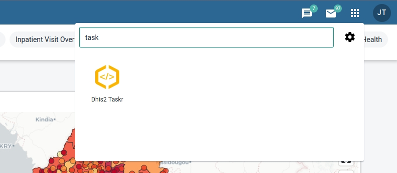
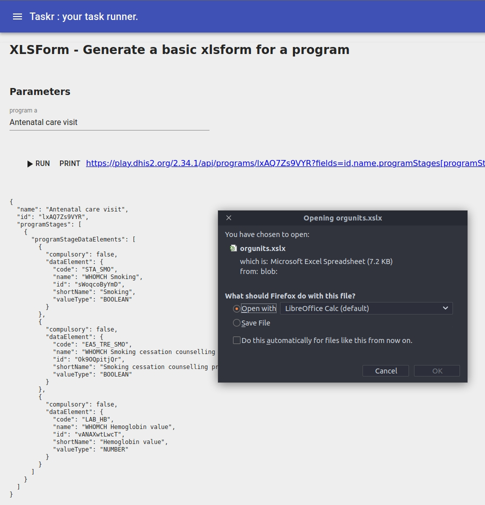
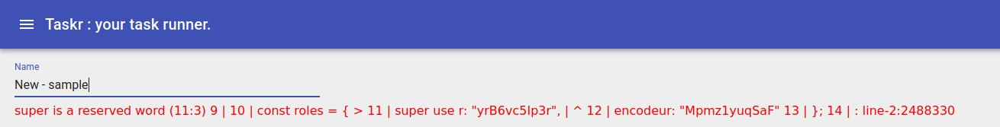
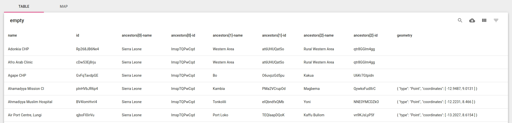
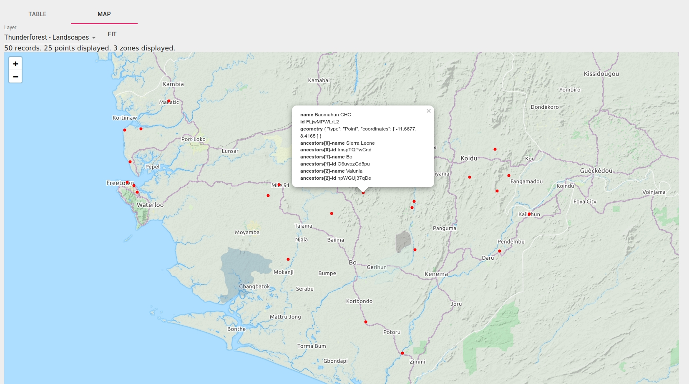
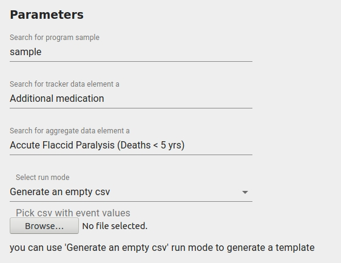
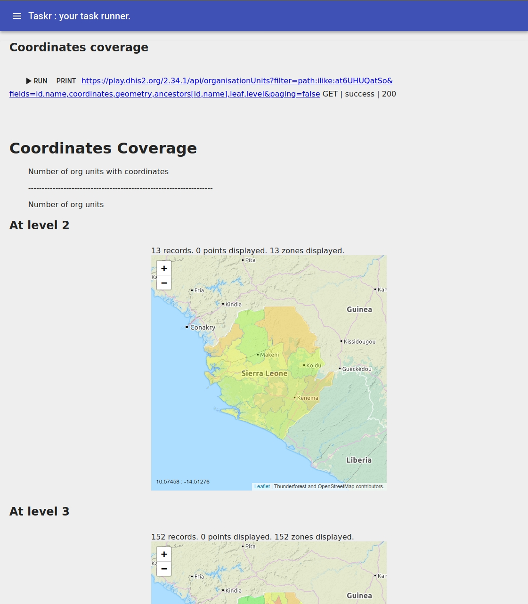

# Table of content

- [Table of content](#table-of-content)
- [Disclaimer](#disclaimer)
- [Small tour](#small-tour)
  - [Open the app](#open-the-app)
  - [Recipes list](#recipes-list)
  - [Recipe page](#recipe-page)
- [Historical pains & motivations](#historical-pains--motivations)
  - [1. Turning an api call results to csv or a map was not easy](#1-turning-an-api-call-results-to-csv-or-a-map-was-not-easy)
  - [2. Coding a dhis2 app is sometimes too much work for just a one shot specific task](#2-coding-a-dhis2-app-is-sometimes-too-much-work-for-just-a-one-shot-specific-task)
  - [3. Combining multiple api calls is hard for exemple in postman.](#3-combining-multiple-api-calls-is-hard-for-exemple-in-postman)
  - [4. Data can come in/out in various format](#4-data-can-come-inout-in-various-format)
  - [5. Sometimes we need JS or GIS super power](#5-sometimes-we-need-js-or-gis-super-power)
  - [6. End user autonomy to re-run the recipe at will](#6-end-user-autonomy-to-re-run-the-recipe-at-will)
  - [7. Standard recipes reusable accross dhis2](#7-standard-recipes-reusable-accross-dhis2)
  - [8. Recipes can accept parameters](#8-recipes-can-accept-parameters)
  - [9. Recipe can return more than a table](#9-recipe-can-return-more-than-a-table)
  - [10. Accessing multiple dhis2 instances](#10-accessing-multiple-dhis2-instances)
- [Getting started](#getting-started)
  - [Install the app](#install-the-app)
  - [Standard recipes](#standard-recipes)
  - [Specific recipes](#specific-recipes)
- [Coding tutorial](#coding-tutorial)
  - [Turn an api call in to a csv](#turn-an-api-call-in-to-a-csv)
    - [v0.0 get all orgunits](#v00-get-all-orgunits)
    - [v0.1 get all orgunits for a certain level as parameter](#v01-get-all-orgunits-for-a-certain-level-as-parameter)
  - [Generate a csv to create users based on the level 3](#generate-a-csv-to-create-users-based-on-the-level-3)
  - [Synchronous api calls in a loop](#synchronous-api-calls-in-a-loop)
  - [Generate a json with download prompt](#generate-a-json-with-download-prompt)
  - [Dhis2 periods](#dhis2-periods)
  - [Let's update things](#lets-update-things)
    - [First a readonly version](#first-a-readonly-version)
    - [Then introduce a "dryRun" mode](#then-introduce-a-dryrun-mode)
    - [Then test on the first record](#then-test-on-the-first-record)
    - [Then run on all users](#then-run-on-all-users)
    - [If the recipe is here to stay](#if-the-recipe-is-here-to-stay)
  - [We want more](#we-want-more)


# Disclaimer

> When the only tool you have is TaskR, everything start to look like a recipe

It gets adictive, you can spend hours automating something that could have been done in 10 minutes clicking in a few screens.

> With great power comes great responsibility

Taskr recipes runs with the user privilege. If you are admin the recipes all the possibilities the admin has.

> To err is human, but for a real disaster you need a computer"

What can harm a dhis2 by clicking the wrong option in a menu in the dataElement option, can turn into a disaster when the same operation is repeated in a loop in taskr. It can get worst when what is in the loop is not the correct action or was not meant on all data elements. Be careful.


# Small tour

## Open the app

Once the app installed you can locate the app in the menu.



## Recipes list


The recipes list screen is accessible via the top left hamburger menu icon. A list of recipes is shown :
   - grey out recipes are "built in".
   - blank recipees are the one created and saved in your dhis2

Click on the run button, you arrive fill on the recipe page.

## Recipe page

Fill in the parameters if needed, click run, the results will show under the buttons.



If an error occur in the recipe (syntax or dhis2 api calls), it will show up on the top of the screen.



If you are in the edit mode the recipe editor will show up.

A recipe is composed of
 - the code (javascript snippet)
 - the paremeters definition (optional, json)
 - the report (optional, markdown with idyll components)

# Historical pains & motivations

## 1. Turning an api call results to csv or a map was not easy

Lets get all orgunits with their coordinates and ancestors as a csv. If the recipe return an array of things with a geometry/coordinates/coordinate field taskr will try to display it also as a map.

```js
const api = await dhis2.api();
const ou = await api.get("organisationUnits", {
  fields: "id,name,ancestors[id,name],geometry",
  paging: false
});

return _.flattenObjects(ou.organisationUnits, ["geometry"]);
```

The table is filterable either via the search icon or more accurately via the filter dialog and you can download the data as a csv via the cloud icon.



The orgunits table is clickable, zoomable, you can switch between different layers. It supports simple coordinates or shapes as defined by dhis2 geometry/coordinates field.



## 2. Coding a dhis2 app is sometimes too much work for just a one shot specific task

Let's say you want to rename all indicators starting by "INDX.Y name" to "IND X.Y - name".

Setting up a dhis2 app requires time and developper knowledge. Taskr is a good tradeoff, you can install/update the app from the app store. With basic programming knowledge or using the standard recipes you can automate already a few tasks without the *initial setup cost*.

## 3. Combining multiple api calls is hard for exemple in postman.

Want to find all the tracker data elements not referenced by program stages ?

There's no link between `/api/dataElements` api and the programs.
The `/api/programs` only return used data elements.
So here we need to combine the 2 calls to find unreferenced data elements.

Since the api call is done via javascript, we can easily combine, merge, filter the results at our will.

## 4. Data can come in/out in various format

We receive data in various forms (csv, xlsx, json...)

We want to produce various formats (csv, xlsx, json), or show a small ui to be able to filter/explore the data.

Taskr recipes can accept them and make the recipe easy to code, it will recieve the already parsed data.

CSV will be parsed by [papaparse](https://www.papaparse.com/) library.
XLSX will be parsed by [xlsx-populate](https://github.com/dtjohnson/xlsx-populate#usage), the recipe can also produce xlsx.


## 5. Sometimes we need JS or GIS super power

In js some trivial function are not in the language, to avoid coding your own function each time in all your recipes [lodash](https://lodash.com/docs) is available in the recipe code

```js
// create dataelement lookup by id
const dataElementById = _.keyBy(resp.dataElements, de => de.id);
```

Let's say you are working on a project setting up a health facility registry. You received data from a partner and need to integrate it with our existing facilities.

You might want to find nearest healthcenter, or the parents orgunits that contains that point. That's why https://turfjs.org/ is integrated in taskr.

Find possible parents based on the coordinates of the point and parent shapes

```js
allOrgunits.forEach(ou => turf.geometrify(ou))
points.forEach(point => {
  const parents = allOrgunits.filter(ou => {
    try {
      return ou.geometry && turf.inside(point, ou.geometry);
    } catch (ignored) {
      return false;
    }
  });
  point.parents = parents.map(ou => ou.name).join(",");
});

```

Find organisation unit within 50 meters

```js
points.forEach(point => {
  const nearBy = ouFosa.organisationUnits
    .filter(ou => {
      return (
        ou.geometry &&
        point.geometry &&
        turf.distance(ou.geometry, point.geometry, { units: "meters" }) < 50
      );
    });
    point.nearBy = nearBy
})
```

## 6. End user autonomy to re-run the recipe at will

Some recipes needs to be re-run multiple times, ideally without a developer help, some possible use cases :
  - a quarterly export with the data in xlsx in a specific format
  - fixing dhis2 data/config, and re-run each time you fixed some of them, to review the remaining one.
  - import some data from last quarter in a known format (but not the one dhis2 expect by default)

## 7. Standard recipes reusable accross dhis2

Some recipes are quiet common to all dhis2 and it should be easy to install the app (without asking a developer to do it)

   - user audit
   - coordinates/geometry audit
   - create users based on csv with username, name, email, roles, password, managed orgunit
   - export events as csv
   - generate an xlsform based on a program
   - ...

Make sure to always have the latest version of taskr.

## 8. Recipes can accept parameters

Most recipes will needs params
   - a dhis2 resources (a program, an orgunit, an orgunit of a given level, a dataset,...)
   - files (xlsx, json, csv)
   - a string (a dhis2 period ?)
   - a select between options

Before running you'll get a small screen to enter them



The parameters are defined currenly as json like this
```json
[
    {
        "id": "program",
        "label": "Search for program",
        "type": "dhis2",
        "resourceName": "programs",
        "default": "sample"
    },
    {
        "id": "datalementTracker",
        "label": "Search for tracker data element",
        "type": "dhis2",
        "resourceName": "dataElements",
        "filter": "domainType:eq:TRACKER"
    },
    {
        "id": "datalementAggregate",
        "label": "Search for aggregate data element",
        "type": "dhis2",
        "resourceName": "dataElements",
        "filter": "domainType:eq:AGGREGATE"
    },
    {
        "id": "mode",
        "label": "Select run mode",
        "type": "select",
        "default": "generateEmptyCsv",
        "choices": [
            [
                "generateEmptyCsv",
                "Generate an empty csv"
            ],
            [
                "dryRun",
                "Import from csv - Dry run"
            ],
            [
                "import",
                "Import from csv - import events"
            ]
        ]
    },
    {
        "id": "file",
        "label": "Pick csv with event values",
        "type": "csv",
        "helperText": "you can use 'Generate an empty csv' run mode to generate a template"
    },
     {
        "id": "filexlsx",
        "label": "Pick xlsx with the data",
        "type": "xlsx",
        "helperText": "you can use 'Generate an empty csv' run mode to generate a template"
    }
]
```

These parameters are then available in the recipe code

```js
const programId = parameters.program.id;

const dryRun = parameters.mode =="dryRun";

const events = parameters.file.data;
```

## 9. Recipe can return more than a table

Some recipes needs to return more than a table.
This is possible thanks to a small report defined as markdown.
Based on [idyll-lang](https://idyll-lang.org/)



The recipe register some datasets.

```js
report.register("stats_level2", stats);
```

The recipe has a report in markdown referencing these datasets, adding some contextual content.

```markdown
[PageOrientation orientation:"landscape" /]
# Coordinates Coverage

> Number of org units with coordinates
> --------------------------------------------------------------------
>                 Number of org units

[PageBreak /]
## At level 2
[FlexBox]
[OrgunitMap lines:stats_level2 /]
[/FlexBox]
[PageBreak /]

```

## 10. Accessing multiple dhis2 instances

Some recipes can access 2 dhis2 instances to "compare" and "align" their metadata.
This is also possible but requires credentials on both dhis2, and correct CORS settings.

```js
const apiDestination = await dhis2.api();
const apiSource = _.cloneDeep(apiIhp);

apiSource.setBaseUrl("https://source.dshi2.org/api");

apiSource.setDefaultHeaders({
  "x-requested-with": "XMLHttpRequest",
  Authorization: "Basic " + btoa(user + ":" + password)
});

// ... then compare groups, orgunits, data element,...
```

# Getting started

## Install the app

The prefered installation mode is via the application management app and the [dhis2 app store](https://github.com/BLSQ/dhis2-taskr#install-from-the-app-store-recommanded)

## Standard recipes
   - List users and do some audit
      - Users with Superuser role
      - Users created but never logged in
      - Last login more than 6 months
      - All enabled users
   - List orgunits and do some audit on their coordinates
      - number of orgunits with coordinates per level
      - orgunits not in the parent shape
   - Create users based on a csv
   - Tracker program to an xlsform
   - Dataset to an xlsform
   - Dhis2 upgrade detect/fix "bad" geojson

Want to promote your recipe in the standard one, open a [pull request](https://github.com/BLSQ/dhis2-taskr) against the recipes.js !

## Specific recipes

You can easily create your own recipes.
See the Following chapter

# Coding tutorial

## Turn an api call in to a csv


### v0.0 get all orgunits

Let's try to fetch all orgunits and their coordinates/geometry.

```js
const api = await dhis2.api();
const ou = await api.get("organisationUnits", {
  fields: "id,name,ancestors[id,name],geometry",
  paging: false
});

return _.flattenObjects(ou.organisationUnits, ["geometry"]);
```

The code is in javascript, if you are not familiar with the language, you can follow numerous [tutorials](https://www.w3schools.com/js/) on the web.

Going further, note :
 - the 2 `await` to wait for the request to complete before processing the next line in the program.
 - the `api` has a get method but also update, patch, delete methods
 - the `"organisationUnits"` is the resource name and the behavior of these api are described in the dhis2 [documentation](https://docs.dhis2.org/master/en/developer/html/dhis2_developer_manual_full.html#webapi)
 - the second parameter `{fields: "..." , paging: false, ...}` can also have a filter string or an array of filter string that follows these [namings](https://docs.dhis2.org/master/en/developer/html/dhis2_developer_manual_full.html#webapi_metadata_object_filter)

### v0.1 get all orgunits for a certain level as parameter

In the "parameters" editor, you can paste

```json

[
    {
        "id": "province",
        "type": "dhis2",
        "label": "Search for Provice",
        "filter": "level:eq:2",
        "resourceName": "organisationUnits"
    }
]

```

Fill in the paremeter `province` via the UI based on autocomplete.

Adapt the code to now filter on the province

```js
const api = await dhis2.api();
const provinceId = parameters.province

const ou = await api.get("organisationUnits", {
  fields: "id,name,ancestors[id,name],geometry",
  paging: false
  filter: ["path:ilike:" + provinceId],
  paging: false
});
return ou;
```

Click run, you will only get the fosa in that province !


## Generate a csv to create users based on the level 3

Let's try to get the level 3 orgunits

```js

const api = await dhis2.api();

const ou = await api.get("organisationUnits", {
  fields: "id,name,path,code,ancestors[id,name]",
  filter: ["level:eq:3"],
  paging: false
});

return ou.organisationUnits

```

This returns all the orgunits filtered on level 3

Now let's add some code to map them as user
replace the end of the script `return ou.organisationUnits` with some mapping code

```js
// utility functions
const upcaseFirst = string => string.charAt(0).toUpperCase() + string.slice(1);

const unaccent = string => string.normalize("NFD").replace(/[\u0300-\u036f]/g, "");

const getRandomInt = max => Math.floor(Math.random() * Math.floor(max));

const normalize = name => name.toLowerCase().replace(/ /g, "")


// transform orgunits to users
const users = ou.organisationUnits.map(ou => {
  const zs_name = ou.name;

  const user = {
    firstName: zs_name,
    surname: ou.code,
    email: "ZS-" + ou.code + "@play.dhis2.org",
    username: unaccent(normalize(zs_name)),
    password:
      upcaseFirst(normalize(zs_name)) +
      "/" +
      getRandomInt(9999999),
    userRole: "Clerk",
    organisationUnits: ou.id,
    dataViewOrganisationUnits: ou.id
  };
  return user;
});

return users;
```

## Synchronous api calls in a loop

Don't use `collection.forEach` or `collection.map`, the remote calls will get executed in parallel and non synchronously, this might hurt your dhis2.

Use the `for(... of ...)` notation, you will get the synchronous handling for free.

```js
for (selected of selectedRows) {
    await api.patch("organisationUnits/" + selected.id, {
      name: selected.name + " (modified by this recipe)"
    })
}
```

## Generate a json with download prompt

This code snippet will turn the metadata variable into json, then trigger a download prompt in the browser.

```js

// generate a metadata json from api calls
// then :

var url = URL.createObjectURL(
  new Blob([JSON.stringify(metadata, undefined, 2)], { type: "text/plain" })
);
var a = document.createElement("a");
document.body.appendChild(a);
a.href = url;
a.download = "metadata.json";
a.click();
window.URL.revokeObjectURL(url);
document.body.removeChild(a);
```

## Dhis2 periods

You might want to turn a year into dhis2 quarters or other frequencies.

`DatePeriods.split(period, frequency)` is what you need

```js
const periods = ["2019", "2019S1", "2019Q3", "201907"];
const frequencies = [
  "monthly",
  "quarterly",
  "yearly",
  "sixMonthly",
  "financialJuly"
];
const results = [];
periods.forEach(period => {
  frequencies.forEach(frequency => {
    results.push(
      [period, frequency].concat(DatePeriods.split(period, frequency))
    );
  });
});

return results;
```


## Let's update things

Be careful !

### First a readonly version

Let's say we created users with the wrong roles and they are all super user and we want them to be tracker encoder.

Let's assume in our case they all have emails like `@tracker.com`

If you plan to use the api.update function, make sure to load ALL the fields and not only the one you need to make your selection.

Let's load the users and identify the subset of users that needs to be fixed with a recipe like this

```js
const api = await dhis2.api();
const ou = await api.get("users", {
  fields: ":all,userCredentials[:all,userRoles[id,name]]",
  filter: "email:ilike:@tracker.com",
  paging: false
});

const roles = {
  superuser: "yrB6vc5Ip3r",
  encoder: "Mpmz1yuqSaF"
};

const usersToFix = ou.users.filter(
  user => user.userCredentials.userRoles[0].id !== roles.encoder
);

return usersToFix
```
Note :
 - avoid spreading dhis2 ids all over the code. See how I reference them using roles.encoder

### Then introduce a "dryRun" mode


```js
const dryRun = true

// ... usersToFix

for (user of usersToFix) {
  user.userCredentials.userRoles = [{ id: roles.encoder }];
  if (!dryRun) {
    // will call the api here
  }
}

return usersToFix

```

### Then test on the first record

```js

// ... usersToFix

for (user of usersToFix.slice(0,1)) {
  user.userCredentials.userRoles = [{ id: roles.encoder }];
  if (!dryRun) {
    await api.update("users/" + user.id, user);
  }
}

return usersToFix

```

- launch in dry run,
- expect a single user,
- change the dryRun to false and
- click run
- assert the good results in the dhis2 UI

### Then run on all users

```js

// ... usersToFix

for (user of usersToFix) {
  user.userCredentials.userRoles = [{ id: roles.encoder }];
  if (!dryRun) {
    await api.update("users/" + user.id, user);
  }
}

return usersToFix

```

### If the recipe is here to stay

Turn the dryRun into UI parameters.

Make sure if defaults to true ;)


## We want more

see the [recipes.js](https://github.com/BLSQ/dhis2-taskr/blob/master/src/recipes.js) for inspirations