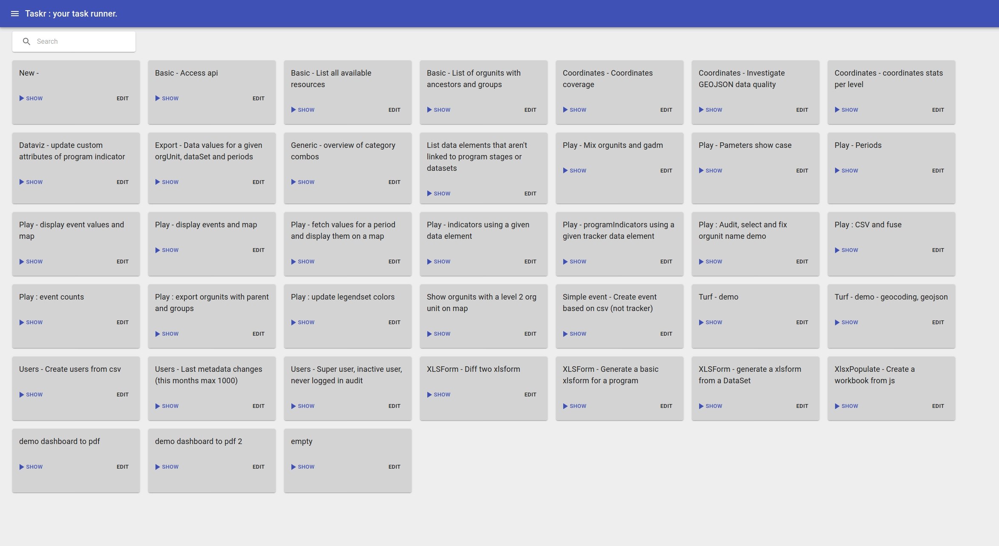

# Table of content

- [Table of content](#table-of-content)
- [Disclaimer](#disclaimer)
- [Small tour](#small-tour)
  - [Recipes list](#recipes-list)
  - [Recipe page](#recipe-page)
- [Historical pains & motivations](#historical-pains--motivations)
  - [1. Turning an api call results to csv or a map was not easy](#1-turning-an-api-call-results-to-csv-or-a-map-was-not-easy)
  - [2. Coding a dhis2 app is sometimes too much work for just a one shot specific task](#2-coding-a-dhis2-app-is-sometimes-too-much-work-for-just-a-one-shot-specific-task)
  - [3. Combining multiple api calls is hard for exemple in postman.](#3-combining-multiple-api-calls-is-hard-for-exemple-in-postman)
  - [4. Data can come in/out in various format](#4-data-can-come-inout-in-various-format)
  - [5. Sometimes we need JS or GIS super power](#5-sometimes-we-need-js-or-gis-super-power)
  - [6. End user autonomy to re-run the recipe at will](#6-end-user-autonomy-to-re-run-the-recipe-at-will)
  - [7. Standard recipes reusable accross dhis2](#7-standard-recipes-reusable-accross-dhis2)
  - [8. Recipes can accept parameters](#8-recipes-can-accept-parameters)
  - [9. Recipe can return more than a table](#9-recipe-can-return-more-than-a-table)
  - [10. Accessing multiple dhis2 instances](#10-accessing-multiple-dhis2-instances)
- [Getting started](#getting-started)
  - [Install the app](#install-the-app)
  - [Standard recipes](#standard-recipes)
    - [Create your own recipe](#create-your-own-recipe)
- [Specific recipes](#specific-recipes)


# Disclaimer

> When the only tool you have is TaskR, everything start to look like a recipe

It gets adictive, you can spend hours automating something that could have been done in 10 minutes clicking in a few screens.

> With great power comes great responsibility

Taskr recipes runs with the user privilege. If you are admin the recipes all the possibilities the admin has.

> To err is human, but for a real disaster you need a computer"

What can harm a dhis2 by clicking the wrong option in a menu in the dataElement option, can turn into a disaster when the same operation is repeated in a loop in taskr. It can get worst when what is in the loop is not the correct action or was not meant on all data elements. Be careful.


# Small tour

## Recipes list




The recipes list screen is accessible via the top left hamburger menu icon. A list of recipes is shown :
   - grey out recipes are "built in".
   - blank recipees are the one created and saved in your dhis2

Click on the run button, you arrive fill on the recipe page.

## Recipe page

Fill in the parameters if needed, click run, the results will show under the buttons.


If an error occur in the recipe, it will show up on the top of the screen.

If you are in the edit mode the recipe editor will show up

# Historical pains & motivations

## 1. Turning an api call results to csv or a map was not easy

Lets get all orgunits with their coordinates and ancestors as a csv. If the recipe return an array of things with a geometry/coordinates/coordinate field taskr will try to display it also as a map.

```js
const api = await dhis2.api();
const ou = await api.get("organisationUnits", {
  fields: "id,name,ancestors[id,name],geometry",
  paging: false
});

return _.flattenObjects(ou.organisationUnits, ["geometry"]);
```

The table is filterable either via the search icon or more accurately via the filter dialog and you can download the data as a csv via the cloud icon.


The orgunits table is clickable, zoomable, you can switch between different layers. It supports simple coordinates or shapes as defined by dhis2 geometry/coordinates field.


## 2. Coding a dhis2 app is sometimes too much work for just a one shot specific task

Let's say you want to rename all indicators starting by "INDX.Y name" to "IND X.Y - name".

Setting up a dhis2 app requires time and developper knowledge. Taskr is a good tradeoff, you can install/update the app from app store. With basic programming knowledge or using the standard recipes you can automate already a few tasks without the *initial setup cost*.

## 3. Combining multiple api calls is hard for exemple in postman.

Want to find all the tracker data elements not referenced by program stages ?

There's no link between `/api/dataElements` api and the programs.
The `/api/programs` only return used data elements.
So here we need to combine the 2 calls to find unreferenced data elements.

## 4. Data can come in/out in various format

We receive data in various forms (csv, xlsx, json...)
We want to produce various formats (csv, xlsx, json), a small ui to be able to filter

Taskr recipes can accept them and make the recipe easy to code, it will recieved the already parsed data.

CSV will be parsed by [papaparse](https://www.papaparse.com/) library.
XLSX will be parsed by [xlsx-populate](https://github.com/dtjohnson/xlsx-populate#usage), the recipe can also produce xlsx.


## 5. Sometimes we need JS or GIS super power

In js some trivial function are not in the language, to avoid coding your own function each time in all your recipes [lodash](https://lodash.com/docs) is available in the recipe code

Let's say you are working on project setting up a health facility registry. You received data from a partner and need to integrate it with our existing facilities.

You might want to find nearest healthcenter, or the parents orgunits that contains that point. That's why https://turfjs.org/ is integrated in the taskr.

Find possible parents based on the coordinates of the point and parent shapes

```js
allOrgunits.forEach(ou => turf.geometrify(ou))
points.forEach(point => {
  const parents = allOrgunits.filter(ou => {
    try {
      return ou.geometry && turf.inside(point, ou.geometry);
    } catch (ignored) {
      return false;
    }
  });
  point.parents = parents.map(ou => ou.name).join(",");
});

```

Find organisation unit within 50 meters

```js
points.forEach(point => {
  const nearBy = ouFosa.organisationUnits
    .filter(ou => {
      return (
        ou.geometry &&
        point.geometry &&
        turf.distance(ou.geometry, point.geometry, { units: "meters" }) < 50
      );
    });
    point.nearBy = nearBy
})
```

## 6. End user autonomy to re-run the recipe at will

Some recipes needs to be re-run multiple times, ideally without a developer help :
  - a quarterly export with the data in xlsx in a specific format
  - fixing dhis2 data/config, and re-run each time you fixed some of them, to review the remaining one.
  - import some data from last quarter in a known format (but not the one dhis2 expect by default)

## 7. Standard recipes reusable accross dhis2

Some recipes are quiet common to all dhis2 and it should be easy to install the app (without asking a developer to do it)

   - user audit
   - coordinates/geometry audit
   - create users based on csv with username, name, email, roles, password, managed orgunit
   - export events as csv
   - generate an xlsform based on a program
   - ...

Make sure to always have the latest version of taskr.

## 8. Recipes can accept parameters

   - most recipes needs params
      - dhis2 resources (a program, an orgunit, an orgunit of a given level, a dataset,...)
      - files
      - a string
      - a select between options


The parameters are defined currenly as json like this
```json
[
    {
        "id": "program",
        "label": "Search for program",
        "type": "dhis2",
        "resourceName": "programs",
        "default": "sample"
    },
    {
        "id": "datalementTracker",
        "label": "Search for tracker data element",
        "type": "dhis2",
        "resourceName": "dataElements",
        "filter": "domainType:eq:TRACKER"
    },
    {
        "id": "datalementAggregate",
        "label": "Search for aggregate data element",
        "type": "dhis2",
        "resourceName": "dataElements",
        "filter": "domainType:eq:AGGREGATE"
    },
    {
        "id": "mode",
        "label": "Select run mode",
        "type": "select",
        "default": "generateEmptyCsv",
        "choices": [
            [
                "generateEmptyCsv",
                "Generate an empty csv"
            ],
            [
                "dryRun",
                "Import from csv - Dry run"
            ],
            [
                "import",
                "Import from csv - import events"
            ]
        ]
    },
    {
        "id": "file",
        "label": "Pick csv with event values",
        "type": "csv",
        "helperText": "you can use 'Generate an empty csv' run mode to generate a template"
    },
     {
        "id": "filexlsx",
        "label": "Pick xlsx with the data",
        "type": "xlsx",
        "helperText": "you can use 'Generate an empty csv' run mode to generate a template"
    }
]
```

These parameters are then available in the recipe code

```js
const programId = parameters.program.id;

const dryRun = parameters.mode =="dryRun";
```

## 9. Recipe can return more than a table

Some recipes needs to return more than a table.
This is possible thanks to a small report defined as markdown.
Based on [idyll-lang](https://idyll-lang.org/)


The recipe register some datasets.

```js
report.register("stats2", stats);
```

The recipe has report in markdown referencing these datasets.

```markdown
[PageOrientation orientation:"landscape" /]
# Coordinates Coverage

> Number of org units with coordinates
> --------------------------------------------------------------------
>                 Number of org units

[PageBreak /]
## At level 2
[FlexBox]
[OrgunitMap lines:stats2 /]
[/FlexBox]
[PageBreak /]

## At level 3
[FlexBox]
[OrgunitMap lines:stats3 /]
[/FlexBox]
[PageBreak /]

## All points not belonging to parent polygon
[FlexBox]
[OrgunitMap lines:`stats4.map(l => _.omit(l, ['color','fillColor']))` width:"700px" height:"700px"/]
[/FlexBox]

```

## 10. Accessing multiple dhis2 instances

Some recipes can access 2 dhis2 for "compare" and "align" their metadata.
This is also possible but requires credentials on both dhis2.

# Getting started

## Install the app

The prefered installation mode is via the application management app and the [dhis2 app store](https://github.com/BLSQ/dhis2-taskr#install-from-the-app-store-recommanded)

## Standard recipes
   - list users and do some audit (last login, admin, ...)
   - list orgunits and do some audit on their coordinates
   - dhis2 upgrade detect "bad" geojson
   - create users based on a csv
   - tracker to xlsform : need to move in the "standard" recipes https://trackerdev.snisrdc.com/api/apps/Dhis2-Taskr/index.html#/recipes/RQKTozhp2Ax
   - dataset to xlsform : need to move in the "standard" recipes https://dhis2.fbrcameroun.org/api/apps/Dhis2-Taskr/index.html#/recipes/zE1oDoaqGeV

### Create your own recipe


# Specific recipes
   - turn an api call in to csv
   - generate a csv of users based on the zone de santé info https://tracker.snisrdc.com/api/apps/Dhis2-Taskr/index.html#/recipes/TJQu4bp3JLo
   - import tracker data from covid xlsx
   - pyramid chirugy : https://docs.google.com/presentation/d/1KfnBmsXu3IudhNkMJv-vQecYFaMRHMoLRxBFM0YF3TA/edit#slide=id.g7f1cca6a1c_2_1576
   - mass renaming
   - custom report
   - migrate to contracts : https://fbp-burundi.bluesquare.org/api/apps/Dhis2-Taskr/index.html#/recipes/jRsD2NbELsg
